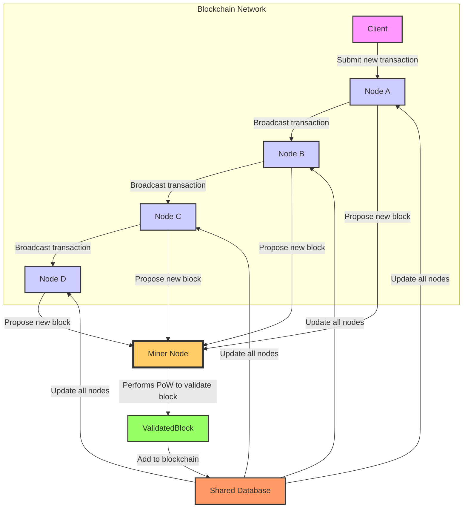

# ProofOfWork
Proof of work (PoW) is a decentralized consensus mechanism that requires network members to expend effort in solving an encryption puzzle

# Proof of Work (PoW) System Overview

## Overview

This document provides a high-level overview of a blockchain network utilizing the Proof of Work (PoW) consensus mechanism. The following sections detail the main components of the system, their roles, and interactions.

## System Overview

The blockchain network described herein involves multiple interacting components that ensure secure and reliable transaction processing and block validation through PoW.

### Components

#### Clients

- **Description**: Users or external systems that initiate transactions within the blockchain network.
- **Interactions**:
  - Submit new transactions to various nodes in the network.

#### Nodes (A, B, C, D)

- **Description**: These are the active entities within the blockchain that receive, validate, and propagate transactions and blocks.
- **Interactions**:
  - Validate and broadcast transactions to ensure network consensus.
  - Propose and validate new blocks to be added to the blockchain.

#### Miner Node

- **Description**: A specialized node responsible for the computational work needed to confirm blocks (Proof of Work).
- **Interactions**:
  - Conducts the Proof of Work for new blocks.
  - Validates and adds confirmed blocks to the blockchain.

#### Validated Block

- **Description**: A representation of successfully validated blocks through PoW.
- **Interactions**:
  - Added to the blockchain and propagated across all nodes.

#### Shared Database

- **Description**: A metaphorical representation of the blockchain itself, which is a distributed ledger shared across all nodes.
- **Interactions**:
  - Receives updates when new blocks are validated and ensures all nodes have the latest and consistent version of the blockchain.

### Diagram

The system interactions are depicted in the diagram included at the beginning of this document. This diagram provides a visual representation of how each component interacts within the network.

### Transactions

- **Broadcast Transaction**: Ensures all nodes in the network have the same data by propagating transactions across the network.
- **Update All Nodes**: After a new block is successfully added, the blockchain updates all nodes to reflect the new state, ensuring consistency and reliability.

## Additional Information

For more detailed implementation details, including security enhancements, transaction validation logic, and network protocols, please refer to the supplementary technical documents and code repositories linked below.
